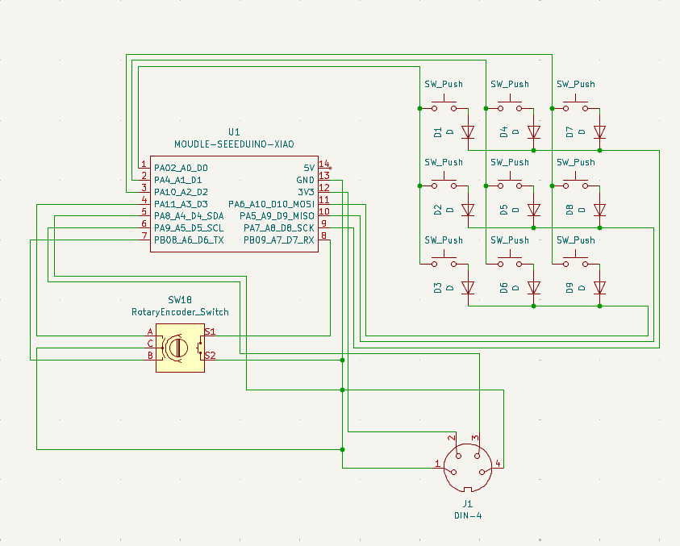
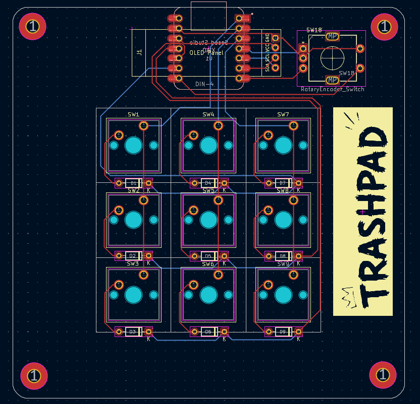
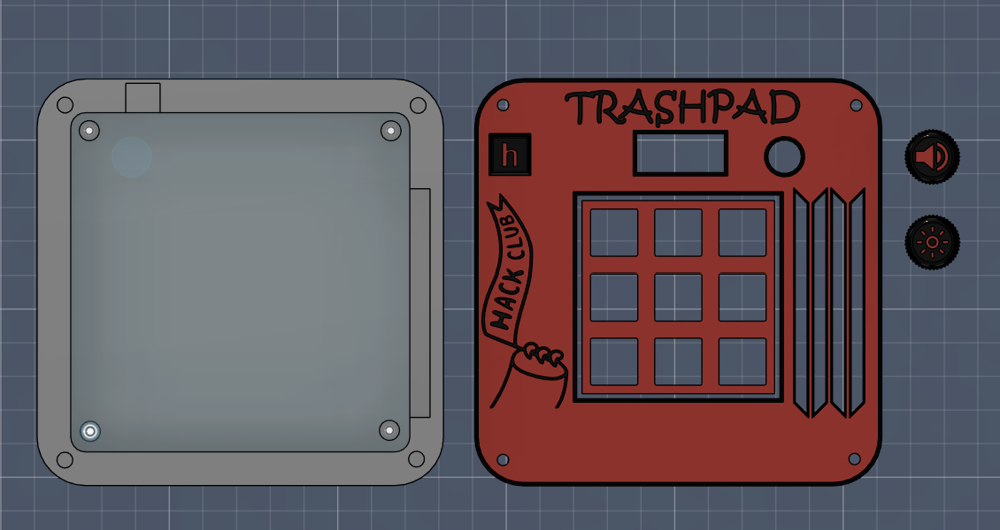

# TRASHPAD ⌨️

a macropad i built because i was tired of reaching for shortcuts that don't exist. got out of hand. zero regrets.

## what is this

TRASHPAD is a custom programmable macropad — 9 keys, a rotary encoder, and a tiny OLED screen that actually tells you what's going on. built it for a hackathon and then kept going way past the point where "good enough" would've been fine. ended up with a full custom PCB, a 3D-printable case, and a website to go with it.

👉 **[try the interactive demo](https://mokxsh404.github.io/TRASHPAD/)**

## what's inside

🔘 **9 programmable keys** — fully remappable through a QMK firmware matrix. bind them to whatever you actually use, not whatever the factory default thinks you need.

🎛️ **EC11 rotary encoder** — volume, scrubbing, scrolling through a timeline, whatever. smooth, satisfying, and somehow the part everyone immediately gravitates to when they pick it up.

📟 **0.91" OLED display** — shows live layer state and active macros so you're not just guessing what your own keyboard is doing. small detail, makes the whole thing feel like a real device instead of a breadboard with delusions of grandeur.

🧠 **XIAO RP2040** — tiny controller, does all the heavy lifting, somehow still cheaper than a fancy keycap set.

## where it's at

PCB is designed, firmware is configured, and the production files (gerbers included) are ready to send to a fab. case is modeled and exported. basically: this thing exists in CAD and code, and the build/test phase is where it's at right now.

## the build

**schematic**

**PCB**

**CAD model**

## bill of materials (bom)

Here is everything you need to source to build your own TRASHPAD. All parts are standard and easy to find on sites like AliExpress, Amazon, or specialized keyboard vendors.

| Component | Description | Qty | Est. Cost | Notes |
| :--- | :--- | :---: | :---: | :--- |
| **Seeed Studio XIAO RP2040** | Dual-core Cortex-M0+ microcontroller, USB-C | 1 | ~$5.50 | Main controller footprint |
| **0.91" I2C OLED Display** | SSD1306, 128x32 screen | 1 | ~$3.00 | 4-pin header connection |
| **EC11 Rotary Encoder** | EC11 encoder with push-button switch, D-shaft (15mm) | 1 | ~$1.50 | 5-pin footprint |
| **Keyswitches** | Cherry MX-compatible switches (Gateron, Kailh, etc.) | 9 | ~$4.00 | Soldered directly to PCB |
| **1u Keycaps** | MX-style keycaps | 9 | ~$3.00 | Standard 1u size |
| **1N4148 Diodes** | Switching diodes | 9 | ~$0.50 | SOD-123 surface mount |
| **TRASHPAD Custom PCB** | Custom printed circuit board (Fab & Shipping) | 1 | ~$6.00 | JLCPCB/PCBWay fab + shipping share |
| **3D Printed Case & Knob** | Top casing, bottom plate, and encoder knob | 1 | ~$5.00 | Using local hub / custom printing service |
| **M3 Threaded Inserts** | Brass heat-set inserts | 4 | ~$0.50 | Ø 4.7mm × 4.0mm inserts |
| **M3 Machine Screws** | M3 screws for case | 4 | ~$0.50 | M3 × 6mm or 8mm button-head |
| **Rubber Feet** | Self-adhesive silicone bumpers | 4 | ~$0.50 | Ø 8mm x 2mm feet |
| **Total Build Cost** | | | **~$30.00** | *(Excludes tools, shipping, USB-C)* |

## repo structure

- `CAD/` — full assembled model for reference (`assembled-model.step`)
- `docs/` — the interactive site/simulator, this is what's live on GitHub Pages
- `Frimware/` — QMK config: keymaps, `config.h`, `keyboard.json`, `rules.mk`
- `PCB/` — KiCad project, schematic, and PCB layout files
- `Production/` — fab-ready output: gerbers, case STEPs (`Top.step`, `Bottom.step`), and the `trashpad/` build folder

## stack

KiCad for the PCB, QMK for firmware, plain HTML/CSS/JS for the site — no frameworks, no build step, just files that work.

## resources that actually helped

- [ai03's PCB guide](https://wiki.ai03.com/) — if you've never routed a board before, start here
- [the keyboard designer wiki](https://wiki.keyboardatelier.com/)
- [Joe Scotto's case tutorials](https://www.youtube.com/watch?v=33mCOnFioY0)

## about

I wanted a macropad.

Instead of buying one, I spent days learning PCB design, designing a case in Fusion, configuring firmware, and making a website for it.

TRASHPAD is the result.
